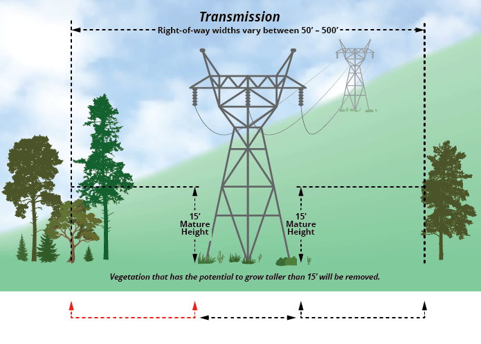

# Electrical Fault Detection and Classification ⚡

## Context:

Transmission lines are the lifelines of a power systems, carrying electricity from where it is generated to where it is needed the most. The demand for more reliable and efficient transmission has grown dramatically (Australian Energy Market Operator, 2023). 

But with complexity comes vulnerability. Modern power systems are full of interconnected, dynamic components that are contantly at risk of electrical faults. 

In this project, I am looking at simulating a power grid featuring four 11kV generators, with a pair stationed at each end of the transmission line. Transformers are strategically placed to help us study and simulate different types of faults, especially those occuring right in the middle of the line, where things can het interesting!

### Understanding Faults in Power Systems

Under normal conditions, power systems operate in a balanced, stable state. 

However, when insulation fails or live wires come into contact, whether due to natural disturbances like lightning, strong winds, or earthquakes, or external factors like falling trees, bird contact, a FAULT occurs. And these faults disrupt the system's balance and can lead to short circuits or outages. 

Power system faults are generally classified into 2 categories:

1. Open-Circuit Faults 
* Occur when one or more conductors break or disconnect.
* Leads to unbalanced voltages and reduced power delivery.

2. Short-Circuit Faults
* These are more critical and occur when conductors tough each other or the ground.
* Symmetrical Faults [L-L-L or L-L-L-G] where all three phases are equally affected, fault currents are balanced in magnitude and phase (120 degrees apart), and are rare, but the most severe type of fault.
* Assymetrcial Faults which are more common and involve only one or two phases. Types include Line-to-Ground (L-G), Line-to-Line (L-L) and Double Line-to-Ground (L-L-G). These faults result in unbalanced conditions. 

## Goals

The dataset explore various types of data visualisation, and we want to build a machine learning model that can predict the Fault Type in a simulated Transmission Line. 

The dataset classifies the types of fault as seen below:

**Inputs - [Ia,Ib,Ic,Va,Vb,Vc]**

Ia = Current in line A

Ib = Current in line B

Ic = Current in line C

Va = Voltage in line A

Vb = Voltage in line B

Vc = Voltage in line C

---

**Examples:**
[G C B A] - Outputs

[0 0 0 0] - No Fault

[1 0 0 0] - Ground Fault

[0 0 0 1] - Fault in Line A

[0 0 1 0] - Fault in Line B

[0 1 0 0] - Fault in Line C

[1 0 0 1] - LG fault (Between Phase A and Ground)

[1 0 1 0] - LG fault (Between Phase B and Ground)

[1 1 0 0] - LG fault (Between Phase C and Ground)

[0 0 1 1] - LL fault (Between Phase B and Phase A)

[0 1 1 0] - LL fault (Between Phase C and Phase B)

[0 1 0 1] - LL fault (Between Phase C and Phase A)

[1 1 0 0] - LG fault (Between Phase C and Ground)

[1 0 1 0] - LG fault (Between Phase B and Ground)

[1 0 0 1] - LG fault (Between Phase A and Ground)

[1 0 1 1] - LLG Fault (Between Phases A,B and Ground)

[1 1 0 1] - LLG Fault (Between Phases A,C and Ground)

[1 1 1 0] - LLG Fault (Between Phases C,B and Ground)

[0 1 1 1] - LLL Fault(Between all three phases)

[1 1 1 1] - LLLG fault( Three phase symmetrical fault)

---
